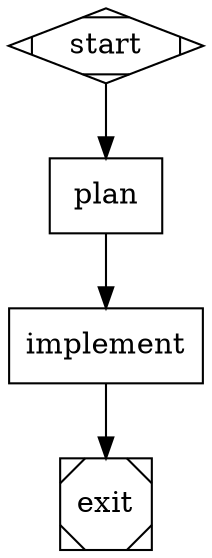

# Attractor

A Go implementation of the [Attractor specification](https://github.com/strongdm/attractor) -- a DOT-based pipeline runner that uses directed graphs to orchestrate multi-stage AI workflows.

Each node in the graph is a task (LLM call, conditional branch, etc.), each edge is a transition with optional conditions, and the engine traverses the graph deterministically from start to exit.

## What This Project Implements

This project implements all three layers of the Attractor spec:

**Layer 1 -- Unified LLM Client** (`internal/llm`): A minimal client that talks to [OpenRouter](https://openrouter.ai/) using the OpenAI-compatible Chat Completions API. Handles tool definitions, tool calls, structured error classification, and usage tracking.

**Layer 2 -- Coding Agent Loop** (`internal/agent`, `internal/tools`): An agentic loop that sends a prompt to the LLM, executes any tool calls the model requests (`read_file`, `write_file`, `edit_file`, `shell`), feeds results back, and repeats until the model is done. Shell commands run inside a Docker container for isolation.

**Layer 3 -- Pipeline Runner** (`internal/dot`, `internal/pipeline`): The Attractor-specific layer. Parses DOT files into directed graphs, validates them against lint rules, and executes them with handler dispatch, edge selection, goal gate enforcement, retry with backoff, checkpointing, and context management.

## Project Structure

```
attractor/
├── cmd/
│   ├── run-retroquest/      # Pipeline runner for RetroQuest Returns
│   ├── test-llm/            # Smoke test for the LLM client
│   ├── test-agent/          # Smoke test for the agent loop
│   └── test-pipeline/       # Smoke test for the pipeline runner
├── internal/
│   ├── llm/                 # Layer 1: LLM client (types, client, errors, OpenRouter adapter)
│   ├── tools/               # Layer 2: Tool implementations (read, write, edit, shell, truncation)
│   ├── agent/               # Layer 2: Agent loop, system prompt, conversation compression
│   ├── dot/                 # Layer 3: DOT lexer, parser, and graph model
│   ├── pipeline/            # Layer 3: Execution engine, handlers, context, checkpoint, validation
│   └── logging/             # Structured logging setup (slog multi-handler)
├── pipelines/               # DOT pipeline definitions (e.g., retroquest-returns-v2.dot)
├── go.mod
└── README.md
```

## Prerequisites

- **Go 1.21+**
- **Docker Desktop** (for the `shell` tool, which runs commands in an isolated container)
- **OpenRouter API key** (set `OPENROUTER_API_KEY` in a `.env` file at the project root)

## Setup

```bash
git clone https://github.com/campallison/attractor.git
cd attractor

# Create a .env file with your OpenRouter API key
echo "OPENROUTER_API_KEY=sk-or-..." > .env
```

## Running Tests

```bash
# Run all unit tests
go test ./...

# Run with verbose output
go test ./... -v

# Run tests for a specific package
go test ./internal/dot/ -v
go test ./internal/pipeline/ -v
```

All tests are table-driven and use [go-cmp](https://pkg.go.dev/github.com/google/go-cmp/cmp) for assertions. Tests do not require an API key or network access.

## Smoke Tests

These require a valid `OPENROUTER_API_KEY` in `.env` and (for the agent/pipeline tests) a running Docker daemon.

```bash
# Layer 1: Test the LLM client directly
go run ./cmd/test-llm

# Layer 2: Test the agent loop (creates a file via tool calls)
go run ./cmd/test-agent

# Layer 3: Test the pipeline runner (parses, validates, and executes a DOT pipeline)
go run ./cmd/test-pipeline
```

## Writing a Pipeline

Pipelines are defined as Graphviz DOT digraphs. A minimal example:



Key concepts:

- **Shapes determine behavior:** `Mdiamond` = start, `Msquare` = exit, `box` = LLM task, `diamond` = conditional routing
- **`$goal` expansion:** The `$goal` variable in prompts is replaced with the graph-level `goal` attribute
- **Per-node model:** Nodes can specify `model="provider/model-name"` to override the pipeline default
- **Goal gates:** Nodes with `goal_gate=true` must succeed before the pipeline can exit
- **Edge conditions:** Edges can have conditions like `condition="outcome=success"` to control routing
- **Retry:** Nodes support `max_retries` with exponential backoff
- **Build gates:** Nodes can specify `check_cmd="go build ./..."` to run a compilation check after each stage. If the check fails, the agent is re-invoked with the error output up to `check_max_retries` times (default 3)
- **Usage tracking:** Each codergen stage writes a `usage.json` with token counts, and the pipeline aggregates totals in `RunResult`
- **Budget cap:** Set `MaxBudgetTokens` on `RunConfig` to halt the pipeline if cumulative token usage exceeds a threshold

## Running a Pipeline

The `run-retroquest` runner demonstrates all pipeline features:

```bash
# Real run with Opus (requires OPENROUTER_API_KEY in .env and Docker)
go run ./cmd/run-retroquest/

# Simulated run (no API key or Docker needed -- tests pipeline structure and logging)
go run ./cmd/run-retroquest/ --simulate

# Cheap test run with a different model + zero data retention
go run ./cmd/run-retroquest/ --model-override google/gemini-2.5-flash --zdr
```

The runner performs a pre-flight checklist (workdir, API key, Docker, model validation against OpenRouter's API, budget sanity) before execution begins.

## Design Decisions

| Decision | Choice | Rationale |
|---|---|---|
| Language | Go | Strong typing maps well to the spec's structured data; good HTTP client and concurrency primitives |
| LLM Provider | OpenRouter | Single API key for multiple model providers; OpenAI-compatible format means one adapter |
| Shell Security | Docker | Commands run in an isolated container, not on the host machine |
| DOT Parser | Hand-rolled | Full control over the spec's strict subset, custom attribute types, and error messages |
| Testing | Table-driven + go-cmp | Consistent patterns, readable diffs, easy to extend |
| Build Gates | `check_cmd` attribute | Compiler-enforced correctness between stages; catches cross-file inconsistencies early |
| Contract-First Design | Interface files from design stage | Downstream stages implement against shared Go interfaces, enforced by `go build` gates |
| Structured Logging | `log/slog` multi-handler | Always-on INFO to terminal, DEBUG to JSON file; no toggle flag |

## Spec Reference

This implementation follows the three Attractor specifications:

- [Attractor Pipeline Spec](https://github.com/strongdm/attractor/blob/main/attractor-spec.md) (Layer 3)
- [Coding Agent Loop Spec](https://github.com/strongdm/attractor/blob/main/coding-agent-loop-spec.md) (Layer 2)
- [Unified LLM Client Spec](https://github.com/strongdm/attractor/blob/main/unified-llm-spec.md) (Layer 1)

## License

MIT
