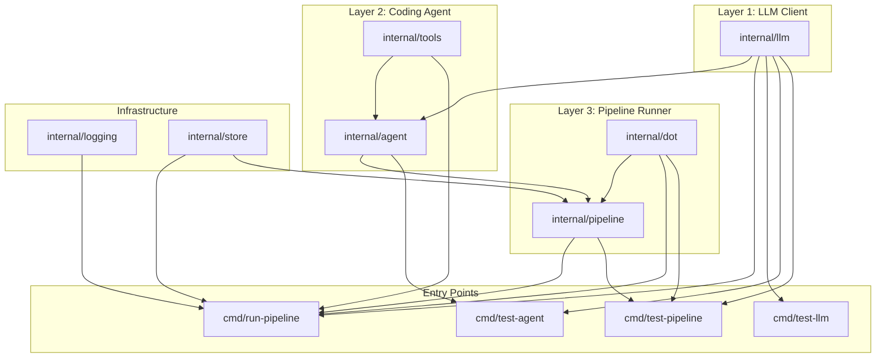
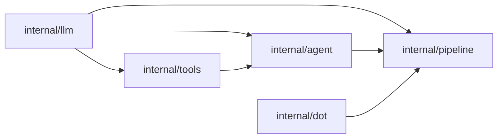
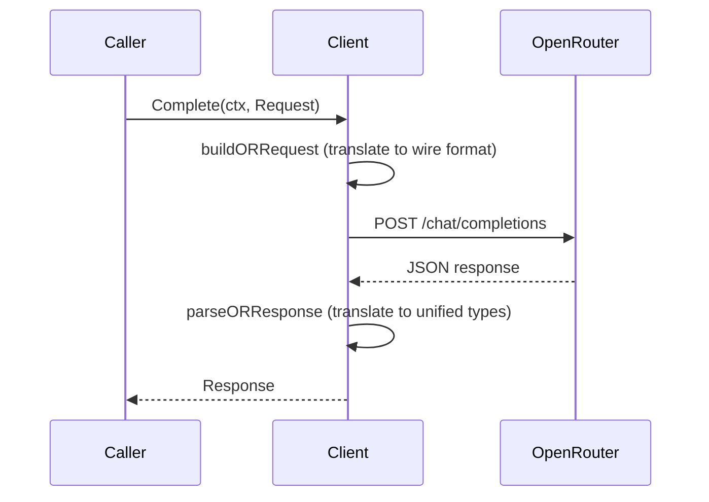
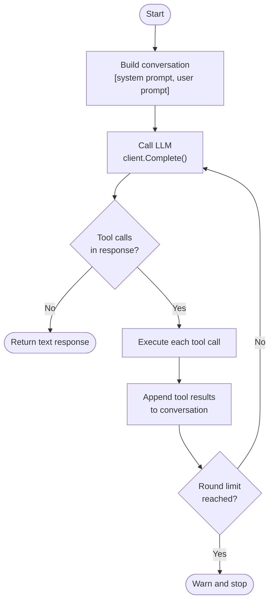
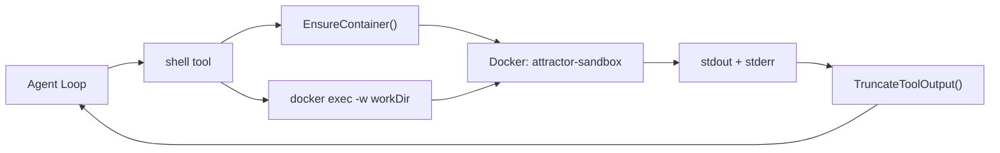
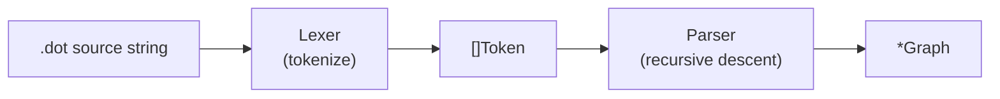
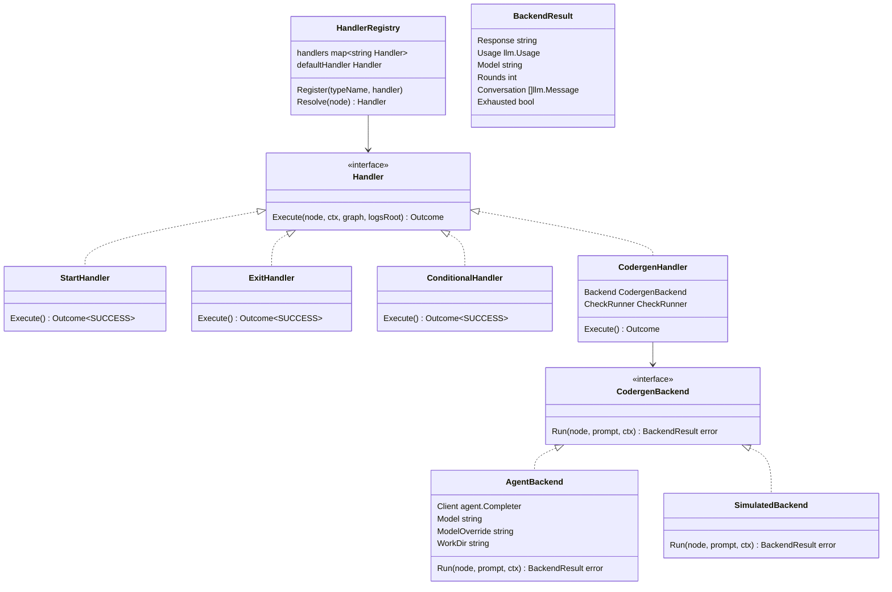
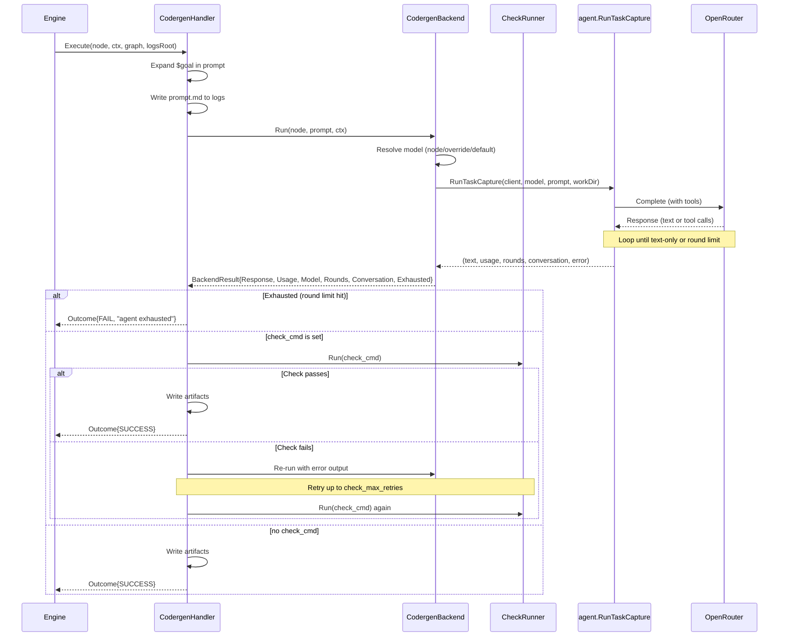
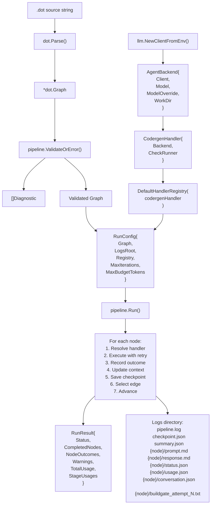
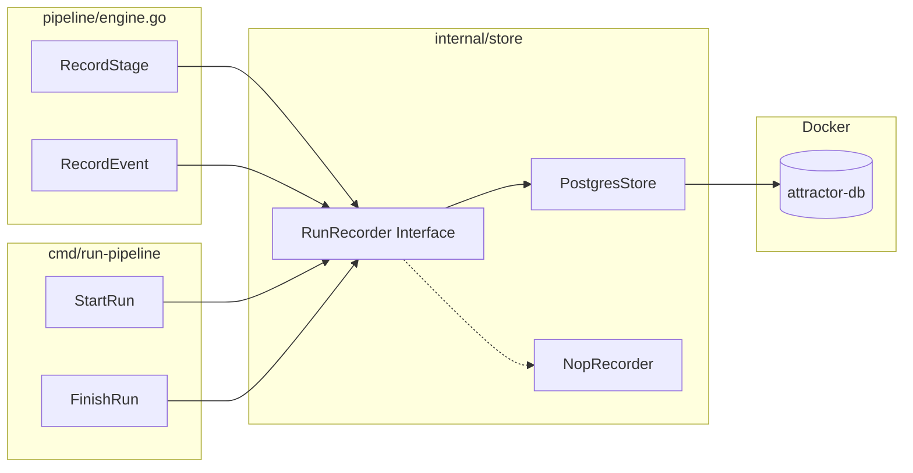

# Attractor Architecture Reference

This document describes the architecture of this Go implementation of the Attractor specification. It covers the dependency graph, data flows, key types, and the design rationale for each layer. Intended as a learning and reference aid.

---

## System Overview

The system is built as three layers, each depending only on the layers below it:



The dependency arrows mean "is imported by." Every dependency is one-directional -- there are no circular imports. The `internal/dot` package has zero internal dependencies, making it independently usable.

---

## Package Dependency Graph



Key property: `internal/dot` depends on nothing internal. `internal/pipeline` depends on `internal/dot` (for graph types), `internal/agent` (for the codergen backend adapter), and `internal/store` (for the `RunRecorder` interface). `internal/agent` depends on `internal/llm` and `internal/tools`. `internal/logging` and `internal/store` depend on nothing internal and are used by the runner entry point. This forms a clean DAG with no risk of circular imports.

---

## Layer 1: Unified LLM Client (`internal/llm`)

### Purpose

Provides a provider-agnostic interface for making LLM chat completion requests. Currently backed by OpenRouter (OpenAI-compatible API).

### Key Types

```
Client              -- entry point; holds API key, base URL, HTTP client
  .Complete(ctx, Request) -> (Response, error)

Request             -- model, messages, tools, tool choice, temperature
Response            -- ID, model, message, finish reason, usage

Message             -- role + []ContentPart + optional ToolCallID
ContentPart         -- tagged union: text | tool_call | tool_result
ToolCall            -- ID, name, arguments (raw JSON)
ToolResultData      -- tool call ID, content string, is-error flag
ToolDefinition      -- name, description, JSON Schema parameters

Usage               -- input/output/total token counts
FinishReason        -- unified reason + raw provider reason
```

### Message Flow



### Error Hierarchy

HTTP errors are classified into typed errors based on status code:

```
ConfigurationError    -- missing API key, bad config (pre-request)
NetworkError          -- transport failure, timeout (no HTTP response)
ProviderError         -- base type for HTTP errors
  AuthenticationError -- 401
  AccessDeniedError   -- 403
  NotFoundError       -- 404
  InvalidRequestError -- 400, 422
  RateLimitError      -- 429 (retryable)
  ServerError         -- 5xx (retryable)
```

### Design Notes

- **Functional options pattern** for `Client` construction: `WithBaseURL()`, `WithHTTPClient()`, `WithZDR()`, `WithPromptCaching()`.
- **`NewClientFromEnv()`** loads `.env` automatically so local development works without shell exports.
- **Zero Data Retention (ZDR):** `WithZDR()` option adds OpenRouter's `provider.zdr: true` preference, routing requests only to providers that enforce zero data retention.
- **Prompt Caching:** `WithPromptCaching()` enables Anthropic's `cache_control` mechanism for system and user messages. Cached prefixes are billed at ~10% of normal input cost. The `Usage` struct tracks `CacheReadTokens` and `CacheCreationTokens`.
- **Wire format translation** is isolated in `openrouter.go` (unexported). Application code only sees the unified types in `types.go`. Adding a new provider means adding a new translation layer without changing any interfaces.

### Files

| File | Lines | Purpose |
|---|---|---|
| `types.go` | 187 | All data types: Message, Request, Response, ToolCall, etc. |
| `client.go` | 120 | Client struct, NewClient, NewClientFromEnv, Complete, .env loader |
| `openrouter.go` | 338 | OpenRouter wire format: request building, response parsing, HTTP call |
| `errors.go` | 134 | Error type hierarchy and HTTP status classification |

---

## Layer 2: Coding Agent Loop (`internal/agent`, `internal/tools`)

### Purpose

An agentic loop that sends a prompt to the LLM with tool definitions, executes any tool calls the model requests, feeds results back, and repeats until the model responds with text only.

### Agent Loop Flow



### Tool Registry

The registry maps tool names to their implementations. Each tool is a `(ToolDefinition, ToolExecutor)` pair:

```
ToolExecutor = func(args json.RawMessage, workDir string) (string, error)

RegisteredTool
  Definition  ToolDefinition    -- name, description, JSON Schema
  Execute     ToolExecutor      -- the implementation function

Registry
  .Register(RegisteredTool)
  .Get(name) -> (RegisteredTool, bool)
  .Definitions() -> []ToolDefinition
  DefaultRegistry(dockerImage) -> *Registry   -- all 4 tools pre-loaded
```

### Tool Implementations

| Tool | File | Description |
|---|---|---|
| `read_file` | `readfile.go` | Read file content with line numbers, optional offset/limit, binary detection |
| `write_file` | `writefile.go` | Write content to file, auto-create parent directories |
| `edit_file` | `editfile.go` | Replace exact string in file, with uniqueness check and optional replace_all |
| `shell` | `shell.go` | Run command in Docker container (`attractor-sandbox`), with timeout and env filtering |

### Shell Security Model

Shell commands run inside a Docker container, not on the host:



- The working directory is bind-mounted into the container.
- Environment variables are filtered: sensitive keys (containing `KEY`, `SECRET`, `TOKEN`, `PASSWORD`, etc.) are excluded from the container environment.
- Commands have a configurable timeout (default 120s).

### Output Truncation

Large tool outputs are truncated using a head/tail split strategy:

```
If output > char limit:
  Keep first ~40% (head)
  Insert warning: "[...truncated...]"
  Keep last ~40% (tail)
```

This preserves the beginning (context) and end (usually the result) of long outputs.

### Two Agent Functions

| Function | Returns | Used By |
|---|---|---|
| `RunTask()` | `error` | `cmd/test-agent` -- prints to stdout |
| `RunTaskCapture()` | `(string, llm.Usage, int, []llm.Message, error)` | Pipeline codergen handler -- captures response text, accumulated token usage, round count, and full conversation history. Accepts `maxRoundsOverride` to set per-stage round limits. |

Both run the identical agent loop; `RunTaskCapture` was added for Layer 3 so the pipeline engine can capture LLM responses without stdout side effects. It returns the final text, the total `llm.Usage` accumulated across all LLM calls in the loop, the number of rounds executed, and the full conversation history (saved as `conversation.json` for post-mortem analysis).

**Agent exhaustion:** When the agent hits the round limit without producing a text-only response, `RunTaskCapture` returns `agent.ErrRoundLimitReached`. This sentinel error causes the pipeline's codergen handler to report `StatusFail`, preventing silent failures from being treated as success. The round limit defaults to 50 but can be overridden per-stage via the `max_rounds` DOT attribute, allowing simpler stages to fail fast while complex stages get more room.

**Conversation compression:** The agent loop compresses conversation history as it grows. After a configurable number of recent rounds (default 4), older tool results are summarized. Compression uses several strategies: `write_file`/`edit_file` results are compressed immediately regardless of age ("write-and-forget"), large `read_file` results get skeleton summaries (first/last few lines), short `shell` outputs are preserved verbatim, and other tool results get one-line path-based summaries.

### Files

| File | Purpose |
|---|---|
| `agent/agent.go` | RunTask, RunTaskCapture (with usage tracking, exhaustion detection, read-loop detection + nudge injection), executeTool, round loop |
| `agent/prompt.go` | BuildSystemPrompt with env context, git deny-list rules, network rules, working memory convention (`_scratch/`) |
| `agent/compress.go` | Conversation history compression (summarizes old tool results to reduce token costs) |
| `tools/tools.go` | ToolExecutor, RegisteredTool, Registry, DefaultRegistry |
| `tools/readfile.go` | read_file implementation, resolvePath with symlink resolution, sensitive file deny-list |
| `tools/writefile.go` | write_file implementation |
| `tools/editfile.go` | edit_file implementation |
| `tools/shell.go` | shell implementation, Docker container management, git command deny-list, env filtering |
| `tools/truncate.go` | Output truncation logic |

---

## Layer 3: Pipeline Runner (`internal/dot`, `internal/pipeline`)

### Purpose

Parses DOT files into directed graphs, validates them, and executes them by traversing nodes, dispatching to handlers, selecting edges, and managing context and checkpoints.

### `internal/dot` -- DOT Parser

Parses the Attractor DOT subset into an in-memory graph model.

#### Parse Pipeline



#### Lexer

Hand-rolled lexer that:
- Strips `//` line comments and `/* */` block comments (preserving newlines for position tracking)
- Preserves comment characters inside quoted strings
- Tracks line and column for error messages
- Produces tokens: `DIGRAPH`, `SUBGRAPH`, `NODE`, `EDGE`, `GRAPH_KW`, `IDENT`, `STRING`, `NUMBER`, `TRUE`, `FALSE`, `LBRACE`, `RBRACE`, `LBRACKET`, `RBRACKET`, `ARROW`, `EQUALS`, `COMMA`, `SEMICOLON`, `EOF`

#### Parser

Recursive descent parser implementing the spec's BNF grammar (Section 2.2):
- **`digraph Name { statements }`** -- one per file
- **Node statements:** `ID [attrs]`
- **Edge statements:** `ID -> ID [-> ID]* [attrs]` (chained edges expanded to pairs)
- **Default blocks:** `node [attrs]`, `edge [attrs]` (apply to subsequent declarations)
- **Subgraphs:** `subgraph Name { statements }` (flattened into parent, defaults scoped)
- **Graph attributes:** `graph [attrs]` or bare `key = value`
- **Attribute blocks:** `[key=value, key=value, ...]`

#### Graph Model

```
Graph
  Name      string
  Attrs     map[string]string       -- graph-level attributes (goal, label, etc.)
  Nodes     []*Node
  Edges     []*Edge

  .Goal() string
  .NodeByID(id) *Node
  .OutgoingEdges(nodeID) []*Edge
  .IncomingEdges(nodeID) []*Edge
  .FindStartNode() *Node            -- shape=Mdiamond, fallback to ID "start"
  .FindExitNode() *Node             -- shape=Msquare, fallback to ID "exit"

Node
  ID        string
  Attrs     map[string]string

  .Shape() string                   -- default "box"
  .NodeLabel() string               -- default is ID
  .Prompt() string
  .Model() string                   -- per-node LLM model override (empty = use default)
  .GoalGate() bool
  .MaxRetries() int
  .MaxRounds() int                   -- per-node agent round limit (0 = use agent default of 50)
  .CheckCmd() string                -- build gate command (e.g. "go build ./...")
  .CheckMaxRetries() int            -- max build gate retries (default 3)
  .RetryTarget() string             -- node to jump to on goal gate failure
  .GetInt(key, fallback) int
  .GetBool(key, fallback) bool
  .GetDuration(key, fallback) time.Duration

Edge
  From, To  string
  Attrs     map[string]string

  .EdgeLabel() string
  .Condition() string
  .Weight() int                     -- default 0
  .LoopRestart() bool
```

### `internal/pipeline` -- Execution Engine

#### Core Execution Loop

Implements spec Section 3.2. This is the heart of the system:


#### Edge Selection Algorithm (5-step)

After each node completes, the engine selects which edge to follow:

```
Step 1: Condition matching
  Evaluate each edge's condition against outcome + context.
  If any conditions match -> pick best by weight, then lexical.

Step 2: Preferred label
  If outcome has preferred_label, find edge whose label matches
  (after normalization: lowercase, strip accelerator prefixes).

Step 3: Suggested next IDs
  If outcome has suggested_next_ids, find first matching edge target.

Step 4: Unconditional edges by weight
  Among edges with no condition, pick highest weight.

Step 5: Lexical tiebreak
  Among equal-weight edges, pick target node ID that is lexically first.

Fallback: If no unconditional edges exist, pick from ALL edges by weight.
```

#### Handler Architecture



Handler resolution follows the spec's precedence:
1. Explicit `type` attribute on the node
2. Shape-based lookup (shape -> handler type via mapping table)
3. Default handler (codergen)

Shape-to-handler-type mapping:

| Shape | Handler Type | Behavior |
|---|---|---|
| `Mdiamond` | `start` | No-op entry point |
| `Msquare` | `exit` | No-op exit point |
| `box` | `codergen` | LLM task (default for all nodes) |
| `diamond` | `conditional` | Pass-through; engine handles routing |
| `hexagon` | `wait.human` | Human gate (Phase 2) |
| `component` | `parallel` | Fan-out (Phase 2) |

#### Codergen Handler Data Flow



#### Build Gates

When a node has `check_cmd` set (e.g., `check_cmd="go build ./..."`), the codergen handler runs this command after the agent completes. If the check fails:

1. The error output is saved as `buildgate_attempt_N.txt`
2. The agent is re-invoked with the original prompt + "--- BUILD GATE FAILURE ---" + the error output + a hint to check `_scratch/` for working notes from the previous attempt
3. This repeats up to `check_max_retries` times (default 3)
4. Token usage is accumulated across all retry invocations
5. If all retries are exhausted, the stage fails

Build gates enable **contract-first design**: the design stage produces Go interface files, downstream stages implement against them, and the compiler enforces consistency via `go build ./...` checks.

#### Read-Loop Detection and Nudge Injection

The agent loop tracks consecutive read-only rounds (rounds where all tool calls are `read_file`, `grep`, `glob`, or `shell` with no `write_file` or `edit_file`). When 5 consecutive read-only rounds are detected:

1. A `agent.read_loop_detected` warning is logged
2. A course-correction message is injected into the conversation as a `user` role message with a `[PIPELINE ENGINE]` prefix, reminding the agent to maintain `_scratch/` notes and begin writing deliverables
3. The consecutive-round counter resets, giving the agent a chance to course-correct
4. At most 1 nudge is issued per stage; if the read-loop persists after the nudge and the threshold is reached again, the agent is terminated early with `ErrReadLoopDetected`

The nudge does not count as a round toward the round limit. The `[PIPELINE ENGINE]` prefix distinguishes engine-injected messages from the original user prompt.

Early termination produces a distinct `ErrReadLoopDetected` error (separate from `ErrRoundLimitReached`), allowing the pipeline handler to report "persistent read-loop detected" rather than a generic "round limit exhausted" failure. The handler includes the round count in the failure message for post-mortem analysis.

#### Empty Stage Detection

After a codergen stage completes successfully, the handler checks whether any deliverable files were written (via `extractFileList`). If the list is empty and the node does not have `allow_empty_output=true`, a `pipeline.stage.empty_output` warning is logged. This is advisory only — the stage still succeeds. Stages that produce text-only output (e.g., analysis stages) can suppress the warning with `allow_empty_output=true` in the DOT node attributes.

#### Context Carryover Between Stages

After each successful codergen stage, the handler extracts a structured summary: which files were created/modified (parsed from tool calls in the conversation), the filesystem diff (ground-truth file changes from snapshots), a truncated response snippet, and scratch notes. Files inside `_scratch/` are excluded from the conversation file list since they are intermediate working notes, not deliverables. When a stage produces a `_scratch/SUMMARY.md`, its contents are included as "Stage notes." When filesystem observation detected changes, the diff is included as "Filesystem changes," giving downstream stages an accurate picture of what was actually written to disk. Long diffs are truncated to prevent prompt bloat.

These summaries are stored in the pipeline `Context` under `stage_summary:{nodeID}` keys. Downstream codergen stages automatically receive prior summaries prepended to their prompts. If a prompt contains `$prior_context`, the summaries replace that variable; otherwise they are auto-prepended. This gives each stage awareness of what earlier stages produced, reducing redundant file reads.

#### Scratch Directory Lifecycle

The engine manages a `_scratch/` directory in the work directory as persistent working memory for agents. The lifecycle follows each codergen stage:

1. **Pre-stage (setup):** The engine creates `_scratch/` and seeds it with `stage_context.md` (stage name, completed stages, task description). A `_scratch/prior/` subdirectory accumulates summaries from earlier stages.
2. **During stage:** The agent uses `_scratch/` for working notes, plans, and intermediate findings (per the system prompt convention). Before finishing, it synthesizes its notes into `_scratch/SUMMARY.md`.
3. **Post-stage (verify):** The engine checks for `_scratch/SUMMARY.md`. If missing, a warning is logged (advisory; the stage is not failed).
4. **Post-stage (archive and clean):** All scratch files are copied to `.attractor-logs/<run>/<stage>/scratch/` for debugging. The work directory's `_scratch/` is cleaned — only `prior/` survives. `SUMMARY.md` is moved to `_scratch/prior/<stage>_summary.md` for downstream stages.

In simulate mode, scratch setup and cleanup are skipped. The `_scratch/` directory is listed in `.gitignore` to prevent agents from committing scratch artifacts.

#### Filesystem Observation

The engine can snapshot the work directory before and after a stage runs to produce a structured diff of filesystem changes. This provides ground-truth data about what files an agent created, modified, or removed — independent of what the agent reported in its conversation.

`SnapshotDir` walks the work directory, recording each regular file's relative path and size. Directories that are engine-managed, version-controlled, or contain dependencies are excluded: `_scratch/`, `.attractor-logs/`, `.git/`, `node_modules/`, `vendor/`. Symlinks are skipped to prevent misrepresentation of directory contents.

`DiffSnapshots` compares a before/after pair of snapshots, categorizing files as added, removed, modified (size changed), or unchanged. The resulting `FileDiff` struct provides a human-readable `String()` method suitable for logging and prompt injection.

The `CodergenHandler` takes a snapshot before and after each stage's agent execution. The diff is logged as a structured `slog` message and written to `filesystem_diff.txt` in the stage's log directory for post-mortem analysis. This ground-truth signal also enhances C3's empty output detection: when the conversation reports no file writes but the filesystem shows changes, the engine logs a distinct informational message rather than the stronger empty-output warning. In simulate mode, snapshots are skipped and `pipeline.snapshot.skipped` is logged, consistent with how scratch and build gates are handled.

#### Context

Thread-safe key-value store (`sync.RWMutex`) shared across all nodes during a run:

```
Context
  .Set(key, value)
  .Get(key, fallback) string
  .GetString(key) string            -- Get with empty fallback
  .Snapshot() map[string]string     -- serializable copy
  .Clone() *Context                 -- deep copy for branch isolation
  .ApplyUpdates(map[string]string)  -- merge updates
  .AppendLog(entry)                 -- append-only run log
  .Logs() []string
```

Built-in context keys set by the engine:

| Key | Set By | Description |
|---|---|---|
| `outcome` | Engine | Last handler status (success, fail, etc.) |
| `preferred_label` | Engine | Last handler's preferred edge label |
| `graph.goal` | Engine | Mirrored from graph goal attribute |
| `current_node` | Engine | ID of the currently executing node |
| `last_stage` | Handler | ID of the last completed stage |
| `last_response` | Handler | Truncated LLM response text |

#### Condition Expression Language

Edge conditions use a minimal boolean expression language:

```
Grammar:
  Condition  = Clause ( "&&" Clause )*
  Clause     = Key "=" Value
             | Key "!=" Value
             | Key                    (bare key: truthy if non-empty)

Key resolution:
  "outcome"            -> outcome.Status as string
  "preferred_label"    -> outcome.PreferredLabel
  "context.X"          -> ctx.Get("context.X") or ctx.Get("X")
  anything else        -> ctx.Get(key)
```

#### Checkpoint

JSON-serializable snapshot saved after every node completion:

```json
{
  "timestamp": "2026-03-06T...",
  "current_node": "implement",
  "completed_nodes": ["start", "plan", "implement"],
  "node_retries": {"implement": 0},
  "context": {"outcome": "success", "graph.goal": "..."},
  "logs": ["node start: success", "node plan: success", ...]
}
```

Enables crash recovery: load checkpoint -> restore context -> resume from the next node after `current_node`.

#### Retry Logic

Nodes with `max_retries > 0` are re-executed on failure:

```
max_attempts = max_retries + 1 (so max_retries=3 means 4 total attempts)

Backoff: exponential with jitter
  delay = 200ms * 2^(attempt-1)
  capped at 60s
  jitter: multiply by random(0.5, 1.5)

On exhaustion:
  If allow_partial=true -> return PARTIAL_SUCCESS
  Otherwise -> return FAIL
```

#### Validation (Lint Rules)

Run before execution to catch structural errors in the graph:

| Rule | Severity | Check |
|---|---|---|
| `start_node` | ERROR | Exactly one start node (shape=Mdiamond) |
| `terminal_node` | ERROR | At least one exit node (shape=Msquare) |
| `start_no_incoming` | ERROR | Start node has no incoming edges |
| `exit_no_outgoing` | ERROR | Exit node has no outgoing edges |
| `edge_target_exists` | ERROR | All edge targets reference existing nodes |
| `reachability` | ERROR | All nodes reachable from start (BFS) |
| `condition_syntax` | ERROR | Edge conditions parse correctly |
| `type_known` | WARNING | Node type values are recognized handler types |
| `retry_target_exists` | WARNING | retry_target references an existing node |
| `goal_gate_has_retry` | WARNING | Goal gate nodes have a retry path |
| `prompt_on_llm_nodes` | WARNING | Codergen nodes have a prompt or label |
| `max_retries` | WARNING | `max_retries` does not exceed 100 |
| `no_fail_recovery` | WARNING | Codergen nodes with only unconditional outgoing edges (any failure halts the pipeline) |
| `exit_reachable` | WARNING | All nodes have a path to an exit node (reverse reachability) |
| `retry_path_to_gate` | WARNING | `retry_target` node can reach back to the goal gate that references it |
| `linear_no_conditions` | INFO | Pipeline has zero conditional edges (any stage failure halts execution) |

#### Run Directory Structure

Each pipeline execution produces:

```
{logs_root}/
  pipeline.log                      -- structured JSON log (DEBUG level, all events)
  checkpoint.json                   -- latest checkpoint
  summary.json                      -- final results (status, usage, duration, model info)
  {node_id}/
    prompt.md                       -- rendered prompt sent to LLM
    response.md                     -- LLM response text
    status.json                     -- node execution outcome
    usage.json                      -- token usage (model, rounds, input/output/total tokens)
    conversation.json               -- full LLM conversation history (for post-mortem)
    buildgate_attempt_N.txt         -- build gate error output (if check_cmd failed)
```

#### Files

| File | Purpose |
|---|---|
| `dot/graph.go` | Graph, Node, Edge types, accessors (Model, MaxRounds, CheckCmd, CheckMaxRetries, etc.), ParseDuration |
| `dot/lexer.go` | Tokenizer with comment stripping and position tracking |
| `dot/parser.go` | Recursive descent parser for DOT subset, recursion depth limit |
| `pipeline/outcome.go` | StageStatus enum, Outcome struct (with observability fields), StageUsage, FileDiffCounts |
| `pipeline/context.go` | Thread-safe key-value context |
| `pipeline/condition.go` | Condition expression evaluator |
| `pipeline/handler.go` | Handler interface, HandlerRegistry, shape mapping |
| `pipeline/handlers.go` | Start, Exit, Conditional, Codergen handlers (with build gate and scratch lifecycle), CheckRunner, BackendResult, backends |
| `pipeline/scratch.go` | Scratch directory lifecycle: SetupScratch, ArchiveAndCleanScratch, copyDir |
| `pipeline/snapshot.go` | Filesystem observation: SnapshotDir, DiffSnapshots, FileDiff |
| `pipeline/engine.go` | Core loop, edge selection, goal gates, retry, backoff, usage aggregation, failure halting, stage recording |
| `pipeline/checkpoint.go` | JSON checkpoint save/load/resume |
| `pipeline/validate.go` | 16 lint rules, Diagnostic model, ValidateOrError |
| `pipeline/backend.go` | AgentBackend: adapts Layer 2 agent loop to CodergenBackend, per-node model override, model override flag |

---

## End-to-End Data Flow

A complete pipeline execution from `.dot` source to final result:



---

## Observability Database (`internal/store`)

### Purpose

Persists pipeline run metadata, stage results, and notable events to a PostgreSQL database for cross-run analysis, pattern detection, and data-driven iteration on the engine. The database is entirely optional — when `ATTRACTOR_DB_URL` is not set, a `NopRecorder` silently discards all writes and the engine behaves identically to before.

### Architecture



### Schema

Three tables in `internal/store/schema.sql`, applied automatically via `CREATE TABLE IF NOT EXISTS`:

- **`pipeline_runs`** — one row per pipeline execution. Captures timestamps, status, pipeline metadata, model configuration, token usage, and stage counts.
- **`stage_results`** — one row per stage per run. Captures node ID, model, status, token usage, duration, filesystem diff counts, scratch summary presence, and build gate results.
- **`stage_events`** — notable moments within a stage: `nudge_injected`, `read_loop_terminated`, `build_gate_pass`, `build_gate_fail`, `empty_output`. Each event has a type, optional round number, and detail text.

### Interface

```go
type RunRecorder interface {
    StartRun(ctx, PipelineRun) (uuid.UUID, error)
    FinishRun(ctx, id, RunFinish) error
    RecordStage(ctx, StageResult) (int64, error)
    RecordEvent(ctx, StageEvent) error
    Close() error
}
```

`NopRecorder` satisfies this interface with no-ops. `PostgresStore` uses `pgx/v5` connection pooling.

### Integration

- **`cmd/run-pipeline`** calls `StartRun` before `pipeline.Run()` and `FinishRun` after, passing the `RunRecorder` and run UUID into `RunConfig`.
- **`pipeline/engine.go`** calls `RecordStage` after each node completes and derives events from the `Outcome` (exhaustion reason, build gate results, empty filesystem output).
- **`pipeline/handlers.go`** surfaces structured fields on `Outcome` (`BuildGateAttempts`, `BuildGatePassed`, `FileDiffCounts`, `ExhaustionReason`, `PromptLength`, `ResponseLength`, `ScratchSummaryProduced`) so the engine can record them without parsing failure reason strings.

### Infrastructure

Local Postgres via Docker with a named volume for persistence:

```bash
docker run -d --name attractor-db -p 5432:5432 \
  -e POSTGRES_USER=attractor -e POSTGRES_PASSWORD=attractor -e POSTGRES_DB=attractor \
  -v attractor-pgdata:/var/lib/postgresql/data postgres:17
```

Connection string stored in `.env` (gitignored) as `ATTRACTOR_DB_URL`. No credentials are hardcoded in Go source or committed to version control.

### Files

| File | Purpose |
|---|---|
| `store/store.go` | `RunRecorder` interface, data structs, `NopRecorder` |
| `store/postgres.go` | `PostgresStore` implementation with `pgx/v5`, schema migration |
| `store/schema.sql` | DDL for all three tables (embedded via `//go:embed`) |
| `store/store_test.go` | Unit tests (NopRecorder) and integration tests (skipped without `ATTRACTOR_DB_URL`) |

---

## Security Hardening

Several defense-in-depth measures have been added beyond the basic implementations:

| Area | Measure | File |
|---|---|---|
| File tools | Path containment: `resolvePath` rejects absolute paths and paths escaping `workDir` | `tools/readfile.go` |
| File tools | Symlink resolution: `filepath.EvalSymlinks` re-checks containment on real path | `tools/readfile.go` |
| File tools | File size guard: `read_file` rejects files over 10MB | `tools/readfile.go` |
| File tools | Sensitive file deny-list: blocks reads of `.env`, `.env.*` files | `tools/readfile.go` |
| Shell tool | Broadened env var filtering: suffixes `_KEY`, `_CREDENTIALS`, `_PASSWD`, `_AUTH`, `_PRIVATE` | `tools/shell.go` |
| Shell tool | Git command deny-list: blocks `push`, `remote`, `config`, `credential`, `submodule` | `tools/shell.go` |
| System prompt | Explicit security rules for git (allow/deny list) and network (no exfiltration) | `agent/prompt.go` |
| Pipeline handlers | Node ID sanitization: strips path separators and `..` from IDs before filesystem use | `pipeline/handlers.go` |
| Pipeline engine | Max iteration guard: configurable cap (default 1000) prevents infinite loops | `pipeline/engine.go` |
| Pipeline engine | Max retries cap: hard limit of 100 in `executeWithRetry` | `pipeline/engine.go` |
| Pipeline engine | Failure halting: pipeline stops when a failed node has only unconditional edges | `pipeline/engine.go` |
| Pipeline engine | Agent exhaustion detection: `ErrRoundLimitReached` prevents silent failures | `agent/agent.go` |
| Pipeline engine | Budget cap with 50%/75% threshold warnings | `pipeline/engine.go` |
| Pipeline engine | Checkpoint warnings: save errors surfaced via `RunResult.Warnings` | `pipeline/engine.go` |
| Runner | Pre-flight checklist: validates workdir, API key, Docker, model IDs, budget | `cmd/run-pipeline/main.go` |
| DOT parser | Recursion depth limit: max 50 nested subgraphs prevents stack overflow | `dot/parser.go` |

---

## Structured Logging (`internal/logging`)

All packages use Go's `log/slog` for structured, leveled logging. The `logging` package configures a multi-handler:

- **Terminal (stderr):** `slog.TextHandler` at INFO level -- concise, human-readable output during pipeline runs
- **Log file (JSON):** `slog.JSONHandler` at DEBUG level -- machine-readable, comprehensive log for post-mortem analysis

Key log events across the codebase:

| Package | Event | Level |
|---|---|---|
| `pipeline/engine` | Node start/done, edge selection, retries, budget warnings (50%/75%), halts | INFO/WARN |
| `pipeline/handlers` | Stage start/done, build gate pass/fail/exhausted, conversation saved, scratch lifecycle, empty output detection | INFO/WARN/ERROR |
| `pipeline/condition` | Condition evaluation results | DEBUG |
| `agent/agent` | Round start, tool execution, text snippets, natural completion, round limit, read-loop detection, nudge injection | INFO/WARN/DEBUG |
| `agent/compress` | Compression statistics (messages compressed, tokens saved) | DEBUG |
| `tools/*` | File reads/writes/edits, shell commands, access denials | INFO/WARN |

---

## Runner (`cmd/run-pipeline`)

The runner is a reference entry point that demonstrates how to execute an Attractor pipeline end-to-end. It orchestrates the full lifecycle:

1. **Parse** the DOT pipeline file
2. **Validate** the graph against lint rules
3. **Pre-flight checklist:** work directory, API key format, Docker daemon, model ID validation (pings OpenRouter API), budget sanity
4. **Set up** logging, Docker container, LLM client, and handler registry
5. **Run** the pipeline
6. **Report** results and write `summary.json`

Key flags:

| Flag | Purpose |
|---|---|
| `--simulate` | Use `SimulatedBackend` (no LLM, no Docker) for structural testing |
| `--model-override MODEL` | Force all stages to use a specific model (useful for cheap test runs) |
| `--zdr` | Enforce Zero Data Retention routing on OpenRouter |
| `--prompt-cache` | Enable prompt caching for Anthropic models (reduces input token cost) |
| `--budget N` | Max total tokens before stopping |
| `--no-docker` | Skip Docker container setup (build gates disabled) |

---

## What Phase 1 Defers

These features are defined in the spec but intentionally omitted from the Phase 1 implementation:

| Feature | Spec Section | Reason for Deferral |
|---|---|---|
| Parallel fan-out/fan-in | 4.8, 4.9 | Complex concurrency; not needed for linear pipelines |
| Human-in-the-loop gates | 4.6, 6.x | Requires UI/input infrastructure |
| Model stylesheet | 8.x | Per-node `model` attribute is supported; full stylesheet syntax is deferred |
| Tool handler (parallelogram) | 4.10 | Pipeline-level tool execution separate from agent tools |
| Manager loop | 4.11 | Supervisor pattern for child pipelines |
| Event system | 9.6 | Observability layer; logging is sufficient for now |
| HTTP server mode | 9.5 | Web API for remote pipeline management |
| Artifact store | 5.5 | Simple file I/O suffices |
| Context fidelity modes | 5.4 | Context window management optimization |
| Subgraph class derivation | 2.10 | Stylesheet-related; basic flattening works |
| Loop restart | 3.2 step 7 | Treated as normal edge in Phase 1 |
| Streaming responses | -- | Blocking is sufficient |

---

## Testing Patterns

All tests follow consistent patterns:

- **Table-driven tests** with named subtests (`t.Run`)
- **`go-cmp`** for assertions (`cmp.Diff`) -- provides readable diffs on failure
- **`t.TempDir()`** for filesystem isolation in tool and checkpoint tests
- **`httptest.NewServer()`** for mock HTTP servers in LLM client tests
- **Mock `Completer` interface** for agent loop tests without real LLM calls
- **`SimulatedBackend`** for pipeline engine tests without real LLM calls
- **`failingBackend`** and **`exhaustedBackend`** for testing error paths through the codergen handler
- **`buildGateBackend`** with mock `CheckRunner` for testing build gate retry logic
- **Regression tests** that parse and validate example pipeline DOT files
