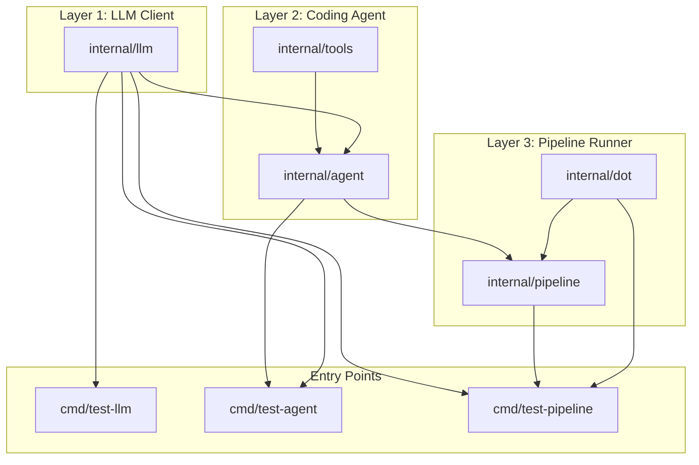
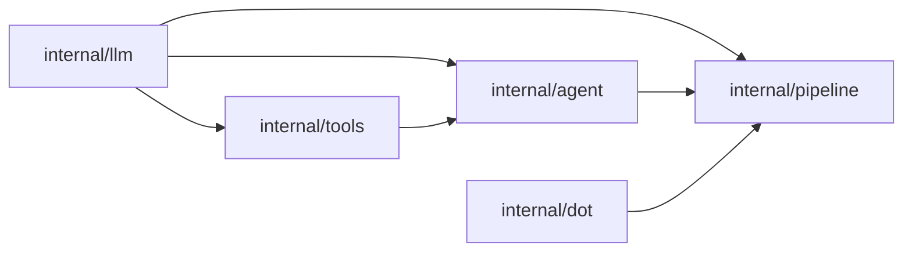
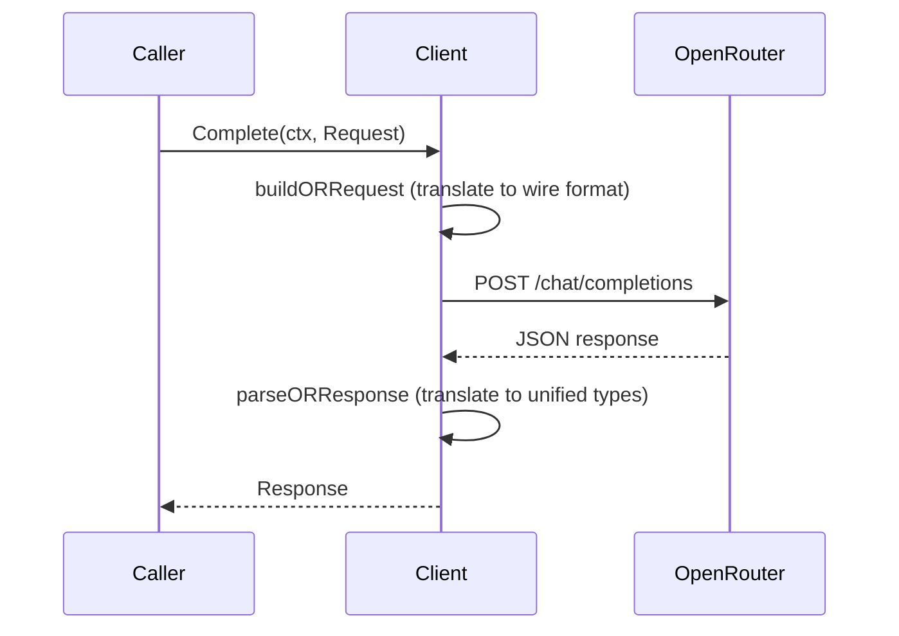
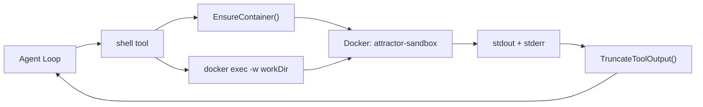
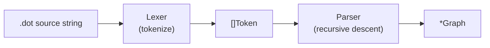
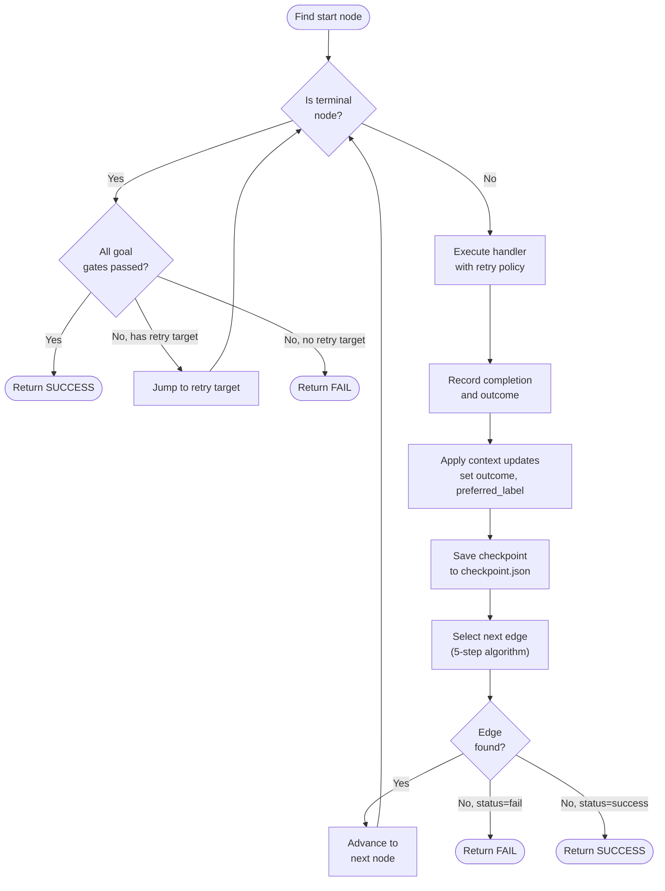
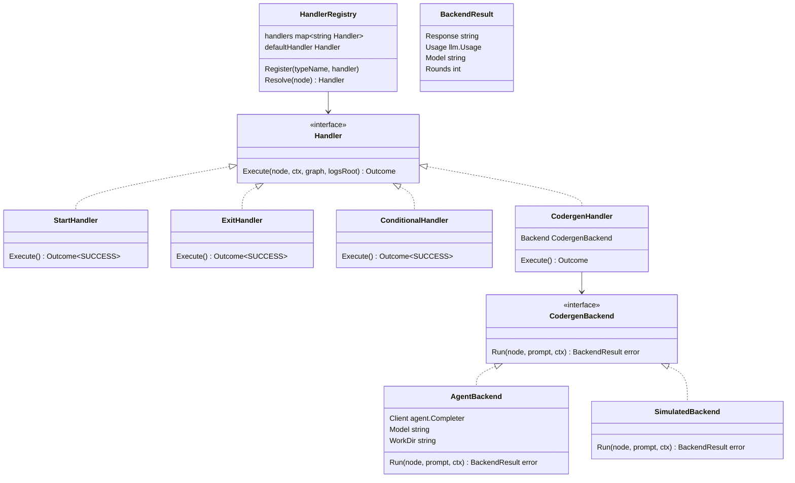
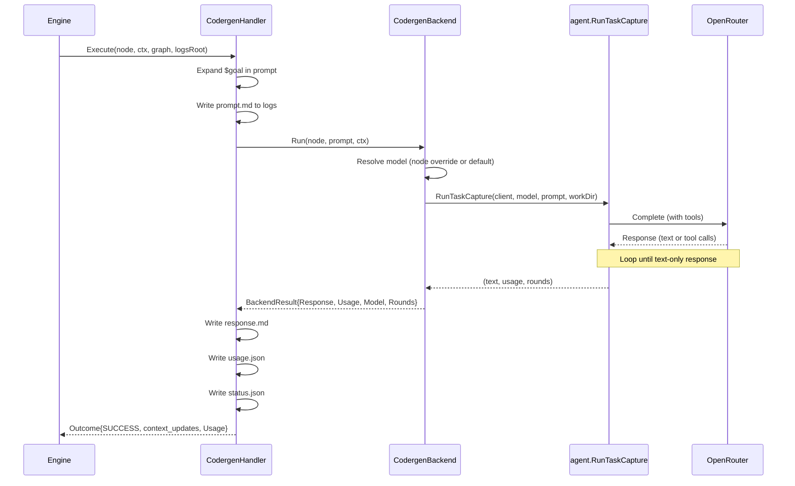
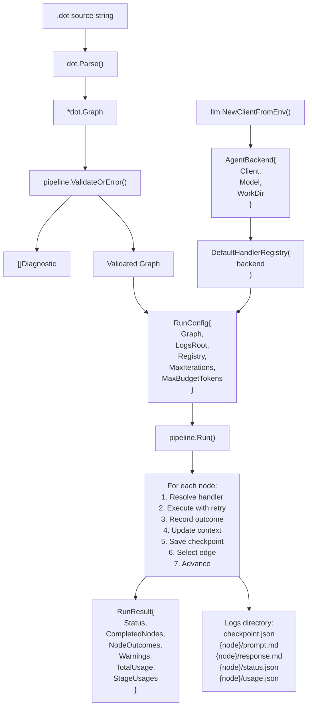

# Attractor Architecture Reference

This document describes the architecture of this Go implementation of the Attractor specification. It covers the dependency graph, data flows, key types, and the design rationale for each layer. Intended as a learning and reference aid.

---

## System Overview

The system is built as three layers, each depending only on the layers below it:



The dependency arrows mean "is imported by." Every dependency is one-directional -- there are no circular imports. The `internal/dot` package has zero internal dependencies, making it independently usable.

---

## Package Dependency Graph



Key property: `internal/dot` depends on nothing internal. `internal/pipeline` depends on `internal/dot` (for graph types) and `internal/agent` (for the codergen backend adapter). `internal/agent` depends on `internal/llm` and `internal/tools`. This forms a clean DAG with no risk of circular imports.

---

## Layer 1: Unified LLM Client (`internal/llm`)

### Purpose

Provides a provider-agnostic interface for making LLM chat completion requests. Currently backed by OpenRouter (OpenAI-compatible API).

### Key Types

```
Client              -- entry point; holds API key, base URL, HTTP client
  .Complete(ctx, Request) -> (Response, error)

Request             -- model, messages, tools, tool choice, temperature
Response            -- ID, model, message, finish reason, usage

Message             -- role + []ContentPart + optional ToolCallID
ContentPart         -- tagged union: text | tool_call | tool_result
ToolCall            -- ID, name, arguments (raw JSON)
ToolResultData      -- tool call ID, content string, is-error flag
ToolDefinition      -- name, description, JSON Schema parameters

Usage               -- input/output/total token counts
FinishReason        -- unified reason + raw provider reason
```

### Message Flow



### Error Hierarchy

HTTP errors are classified into typed errors based on status code:

```
ConfigurationError    -- missing API key, bad config (pre-request)
NetworkError          -- transport failure, timeout (no HTTP response)
ProviderError         -- base type for HTTP errors
  AuthenticationError -- 401
  AccessDeniedError   -- 403
  NotFoundError       -- 404
  InvalidRequestError -- 400, 422
  RateLimitError      -- 429 (retryable)
  ServerError         -- 5xx (retryable)
```

### Design Notes

- **Functional options pattern** for `Client` construction: `WithBaseURL()`, `WithHTTPClient()`.
- **`NewClientFromEnv()`** loads `.env` automatically so local development works without shell exports.
- **Wire format translation** is isolated in `openrouter.go` (unexported). Application code only sees the unified types in `types.go`. Adding a new provider means adding a new translation layer without changing any interfaces.

### Files

| File | Lines | Purpose |
|---|---|---|
| `types.go` | 187 | All data types: Message, Request, Response, ToolCall, etc. |
| `client.go` | 120 | Client struct, NewClient, NewClientFromEnv, Complete, .env loader |
| `openrouter.go` | 338 | OpenRouter wire format: request building, response parsing, HTTP call |
| `errors.go` | 134 | Error type hierarchy and HTTP status classification |

---

## Layer 2: Coding Agent Loop (`internal/agent`, `internal/tools`)

### Purpose

An agentic loop that sends a prompt to the LLM with tool definitions, executes any tool calls the model requests, feeds results back, and repeats until the model responds with text only.

### Agent Loop Flow


### Tool Registry

The registry maps tool names to their implementations. Each tool is a `(ToolDefinition, ToolExecutor)` pair:

```
ToolExecutor = func(args json.RawMessage, workDir string) (string, error)

RegisteredTool
  Definition  ToolDefinition    -- name, description, JSON Schema
  Execute     ToolExecutor      -- the implementation function

Registry
  .Register(RegisteredTool)
  .Get(name) -> (RegisteredTool, bool)
  .Definitions() -> []ToolDefinition
  DefaultRegistry(dockerImage) -> *Registry   -- all 4 tools pre-loaded
```

### Tool Implementations

| Tool | File | Description |
|---|---|---|
| `read_file` | `readfile.go` | Read file content with line numbers, optional offset/limit, binary detection |
| `write_file` | `writefile.go` | Write content to file, auto-create parent directories |
| `edit_file` | `editfile.go` | Replace exact string in file, with uniqueness check and optional replace_all |
| `shell` | `shell.go` | Run command in Docker container (`attractor-sandbox`), with timeout and env filtering |

### Shell Security Model

Shell commands run inside a Docker container, not on the host:



- The working directory is bind-mounted into the container.
- Environment variables are filtered: sensitive keys (containing `KEY`, `SECRET`, `TOKEN`, `PASSWORD`, etc.) are excluded from the container environment.
- Commands have a configurable timeout (default 120s).

### Output Truncation

Large tool outputs are truncated using a head/tail split strategy:

```
If output > char limit:
  Keep first ~40% (head)
  Insert warning: "[...truncated...]"
  Keep last ~40% (tail)
```

This preserves the beginning (context) and end (usually the result) of long outputs.

### Two Agent Functions

| Function | Returns | Used By |
|---|---|---|
| `RunTask()` | `error` | `cmd/test-agent` -- prints to stdout |
| `RunTaskCapture()` | `(string, llm.Usage, int, error)` | Pipeline codergen handler -- captures response text, accumulated token usage, and round count |

Both run the identical agent loop; `RunTaskCapture` was added for Layer 3 so the pipeline engine can capture LLM responses without stdout side effects. It returns the final text, the total `llm.Usage` accumulated across all LLM calls in the loop, and the number of rounds executed.

### Files

| File | Lines | Purpose |
|---|---|---|
| `agent/agent.go` | 172 | RunTask, RunTaskCapture (with usage tracking), executeTool, round loop |
| `agent/prompt.go` | 19 | BuildSystemPrompt with env context (workdir, platform, date) |
| `tools/tools.go` | 64 | ToolExecutor, RegisteredTool, Registry, DefaultRegistry |
| `tools/readfile.go` | 159 | read_file implementation, resolvePath with symlink resolution, file size guard |
| `tools/writefile.go` | 63 | write_file implementation |
| `tools/editfile.go` | 99 | edit_file implementation |
| `tools/shell.go` | 193 | shell implementation, Docker container management, broadened env filtering |
| `tools/truncate.go` | 45 | Output truncation logic |

---

## Layer 3: Pipeline Runner (`internal/dot`, `internal/pipeline`)

### Purpose

Parses DOT files into directed graphs, validates them, and executes them by traversing nodes, dispatching to handlers, selecting edges, and managing context and checkpoints.

### `internal/dot` -- DOT Parser

Parses the Attractor DOT subset into an in-memory graph model.

#### Parse Pipeline



#### Lexer

Hand-rolled lexer that:
- Strips `//` line comments and `/* */` block comments (preserving newlines for position tracking)
- Preserves comment characters inside quoted strings
- Tracks line and column for error messages
- Produces tokens: `DIGRAPH`, `SUBGRAPH`, `NODE`, `EDGE`, `GRAPH_KW`, `IDENT`, `STRING`, `NUMBER`, `TRUE`, `FALSE`, `LBRACE`, `RBRACE`, `LBRACKET`, `RBRACKET`, `ARROW`, `EQUALS`, `COMMA`, `SEMICOLON`, `EOF`

#### Parser

Recursive descent parser implementing the spec's BNF grammar (Section 2.2):
- **`digraph Name { statements }`** -- one per file
- **Node statements:** `ID [attrs]`
- **Edge statements:** `ID -> ID [-> ID]* [attrs]` (chained edges expanded to pairs)
- **Default blocks:** `node [attrs]`, `edge [attrs]` (apply to subsequent declarations)
- **Subgraphs:** `subgraph Name { statements }` (flattened into parent, defaults scoped)
- **Graph attributes:** `graph [attrs]` or bare `key = value`
- **Attribute blocks:** `[key=value, key=value, ...]`

#### Graph Model

```
Graph
  Name      string
  Attrs     map[string]string       -- graph-level attributes (goal, label, etc.)
  Nodes     []*Node
  Edges     []*Edge

  .Goal() string
  .NodeByID(id) *Node
  .OutgoingEdges(nodeID) []*Edge
  .IncomingEdges(nodeID) []*Edge
  .FindStartNode() *Node            -- shape=Mdiamond, fallback to ID "start"
  .FindExitNode() *Node             -- shape=Msquare, fallback to ID "exit"

Node
  ID        string
  Attrs     map[string]string

  .Shape() string                   -- default "box"
  .NodeLabel() string               -- default is ID
  .Prompt() string
  .Model() string                   -- per-node LLM model override (empty = use default)
  .GoalGate() bool
  .MaxRetries() int
  .GetInt(key, fallback) int
  .GetBool(key, fallback) bool
  .GetDuration(key, fallback) time.Duration

Edge
  From, To  string
  Attrs     map[string]string

  .EdgeLabel() string
  .Condition() string
  .Weight() int                     -- default 0
  .LoopRestart() bool
```

### `internal/pipeline` -- Execution Engine

#### Core Execution Loop

Implements spec Section 3.2. This is the heart of the system:



#### Edge Selection Algorithm (5-step)

After each node completes, the engine selects which edge to follow:

```
Step 1: Condition matching
  Evaluate each edge's condition against outcome + context.
  If any conditions match -> pick best by weight, then lexical.

Step 2: Preferred label
  If outcome has preferred_label, find edge whose label matches
  (after normalization: lowercase, strip accelerator prefixes).

Step 3: Suggested next IDs
  If outcome has suggested_next_ids, find first matching edge target.

Step 4: Unconditional edges by weight
  Among edges with no condition, pick highest weight.

Step 5: Lexical tiebreak
  Among equal-weight edges, pick target node ID that is lexically first.

Fallback: If no unconditional edges exist, pick from ALL edges by weight.
```

#### Handler Architecture



Handler resolution follows the spec's precedence:
1. Explicit `type` attribute on the node
2. Shape-based lookup (shape -> handler type via mapping table)
3. Default handler (codergen)

Shape-to-handler-type mapping:

| Shape | Handler Type | Behavior |
|---|---|---|
| `Mdiamond` | `start` | No-op entry point |
| `Msquare` | `exit` | No-op exit point |
| `box` | `codergen` | LLM task (default for all nodes) |
| `diamond` | `conditional` | Pass-through; engine handles routing |
| `hexagon` | `wait.human` | Human gate (Phase 2) |
| `component` | `parallel` | Fan-out (Phase 2) |

#### Codergen Handler Data Flow



#### Context

Thread-safe key-value store (`sync.RWMutex`) shared across all nodes during a run:

```
Context
  .Set(key, value)
  .Get(key, fallback) string
  .GetString(key) string            -- Get with empty fallback
  .Snapshot() map[string]string     -- serializable copy
  .Clone() *Context                 -- deep copy for branch isolation
  .ApplyUpdates(map[string]string)  -- merge updates
  .AppendLog(entry)                 -- append-only run log
  .Logs() []string
```

Built-in context keys set by the engine:

| Key | Set By | Description |
|---|---|---|
| `outcome` | Engine | Last handler status (success, fail, etc.) |
| `preferred_label` | Engine | Last handler's preferred edge label |
| `graph.goal` | Engine | Mirrored from graph goal attribute |
| `current_node` | Engine | ID of the currently executing node |
| `last_stage` | Handler | ID of the last completed stage |
| `last_response` | Handler | Truncated LLM response text |

#### Condition Expression Language

Edge conditions use a minimal boolean expression language:

```
Grammar:
  Condition  = Clause ( "&&" Clause )*
  Clause     = Key "=" Value
             | Key "!=" Value
             | Key                    (bare key: truthy if non-empty)

Key resolution:
  "outcome"            -> outcome.Status as string
  "preferred_label"    -> outcome.PreferredLabel
  "context.X"          -> ctx.Get("context.X") or ctx.Get("X")
  anything else        -> ctx.Get(key)
```

#### Checkpoint

JSON-serializable snapshot saved after every node completion:

```json
{
  "timestamp": "2026-03-06T...",
  "current_node": "implement",
  "completed_nodes": ["start", "plan", "implement"],
  "node_retries": {"implement": 0},
  "context": {"outcome": "success", "graph.goal": "..."},
  "logs": ["node start: success", "node plan: success", ...]
}
```

Enables crash recovery: load checkpoint -> restore context -> resume from the next node after `current_node`.

#### Retry Logic

Nodes with `max_retries > 0` are re-executed on failure:

```
max_attempts = max_retries + 1 (so max_retries=3 means 4 total attempts)

Backoff: exponential with jitter
  delay = 200ms * 2^(attempt-1)
  capped at 60s
  jitter: multiply by random(0.5, 1.5)

On exhaustion:
  If allow_partial=true -> return PARTIAL_SUCCESS
  Otherwise -> return FAIL
```

#### Validation (Lint Rules)

Run before execution to catch structural errors in the graph:

| Rule | Severity | Check |
|---|---|---|
| `start_node` | ERROR | Exactly one start node (shape=Mdiamond) |
| `terminal_node` | ERROR | At least one exit node (shape=Msquare) |
| `start_no_incoming` | ERROR | Start node has no incoming edges |
| `exit_no_outgoing` | ERROR | Exit node has no outgoing edges |
| `edge_target_exists` | ERROR | All edge targets reference existing nodes |
| `reachability` | ERROR | All nodes reachable from start (BFS) |
| `condition_syntax` | ERROR | Edge conditions parse correctly |
| `type_known` | WARNING | Node type values are recognized handler types |
| `retry_target_exists` | WARNING | retry_target references an existing node |
| `goal_gate_has_retry` | WARNING | Goal gate nodes have a retry path |
| `prompt_on_llm_nodes` | WARNING | Codergen nodes have a prompt or label |
| `max_retries` | WARNING | `max_retries` does not exceed 100 |

#### Run Directory Structure

Each pipeline execution produces:

```
{logs_root}/
  checkpoint.json                   -- latest checkpoint
  {node_id}/
    prompt.md                       -- rendered prompt sent to LLM
    response.md                     -- LLM response text
    status.json                     -- node execution outcome
    usage.json                      -- token usage (model, rounds, input/output/total tokens)
```

#### Files

| File | Lines | Purpose |
|---|---|---|
| `dot/graph.go` | 259 | Graph, Node, Edge types, accessors (incl. Model()), helpers, ParseDuration |
| `dot/lexer.go` | 319 | Tokenizer with comment stripping and position tracking |
| `dot/parser.go` | 358 | Recursive descent parser for DOT subset, recursion depth limit |
| `pipeline/outcome.go` | 42 | StageStatus enum, Outcome struct, and StageUsage type |
| `pipeline/context.go` | 95 | Thread-safe key-value context |
| `pipeline/condition.go` | 64 | Condition expression evaluator |
| `pipeline/handler.go` | 64 | Handler interface, HandlerRegistry, shape mapping |
| `pipeline/handlers.go` | 192 | Start, Exit, Conditional, Codergen handlers, BackendResult, backends |
| `pipeline/engine.go` | 401 | Core loop, edge selection, goal gates, retry, backoff, usage aggregation |
| `pipeline/checkpoint.go` | 84 | JSON checkpoint save/load/resume |
| `pipeline/validate.go` | 399 | 12 lint rules (incl. max_retries check), Diagnostic model, ValidateOrError |
| `pipeline/backend.go` | 34 | AgentBackend: adapts Layer 2 agent loop to CodergenBackend, per-node model override |

---

## End-to-End Data Flow

A complete pipeline execution from `.dot` source to final result:



---

## Security Hardening

Several defense-in-depth measures have been added beyond the basic implementations:

| Area | Measure | File |
|---|---|---|
| File tools | Path containment: `resolvePath` rejects absolute paths and paths escaping `workDir` | `tools/readfile.go` |
| File tools | Symlink resolution: `filepath.EvalSymlinks` re-checks containment on real path | `tools/readfile.go` |
| File tools | File size guard: `read_file` rejects files over 10MB | `tools/readfile.go` |
| Shell tool | Broadened env var filtering: suffixes `_KEY`, `_CREDENTIALS`, `_PASSWD`, `_AUTH`, `_PRIVATE` | `tools/shell.go` |
| Pipeline handlers | Node ID sanitization: strips path separators and `..` from IDs before filesystem use | `pipeline/handlers.go` |
| Pipeline engine | Max iteration guard: configurable cap (default 1000) prevents infinite loops | `pipeline/engine.go` |
| Pipeline engine | Max retries cap: hard limit of 100 in `executeWithRetry` | `pipeline/engine.go` |
| Pipeline engine | Checkpoint warnings: save errors surfaced via `RunResult.Warnings` | `pipeline/engine.go` |
| DOT parser | Recursion depth limit: max 50 nested subgraphs prevents stack overflow | `dot/parser.go` |

---

## What Phase 1 Defers

These features are defined in the spec but intentionally omitted from the Phase 1 implementation:

| Feature | Spec Section | Reason for Deferral |
|---|---|---|
| Parallel fan-out/fan-in | 4.8, 4.9 | Complex concurrency; not needed for linear pipelines |
| Human-in-the-loop gates | 4.6, 6.x | Requires UI/input infrastructure |
| Model stylesheet | 8.x | Per-node `model` attribute is supported; full stylesheet syntax is deferred |
| Tool handler (parallelogram) | 4.10 | Pipeline-level tool execution separate from agent tools |
| Manager loop | 4.11 | Supervisor pattern for child pipelines |
| Event system | 9.6 | Observability layer; logging is sufficient for now |
| HTTP server mode | 9.5 | Web API for remote pipeline management |
| Artifact store | 5.5 | Simple file I/O suffices |
| Context fidelity modes | 5.4 | Context window management optimization |
| Subgraph class derivation | 2.10 | Stylesheet-related; basic flattening works |
| Loop restart | 3.2 step 7 | Treated as normal edge in Phase 1 |
| Streaming responses | -- | Blocking is sufficient |

---

## Testing Patterns

All tests follow consistent patterns:

- **Table-driven tests** with named subtests (`t.Run`)
- **`go-cmp`** for assertions (`cmp.Diff`) -- provides readable diffs on failure
- **`t.TempDir()`** for filesystem isolation in tool and checkpoint tests
- **`httptest.NewServer()`** for mock HTTP servers in LLM client tests
- **Mock `Completer` interface** for agent loop tests without real LLM calls
- **`SimulatedBackend`** for pipeline engine tests without real LLM calls
- **`failingBackend`** for testing error paths through the codergen handler

Test count: 140 top-level tests (354 including table-driven subtests) across 5 packages.
